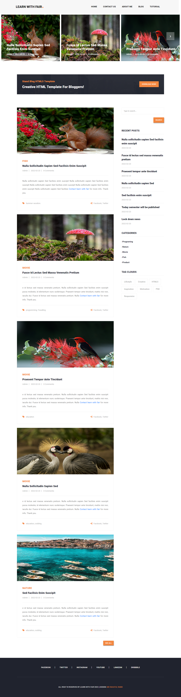
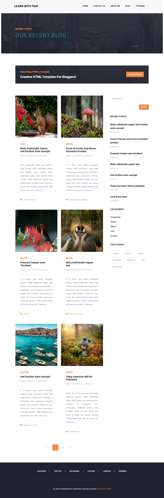
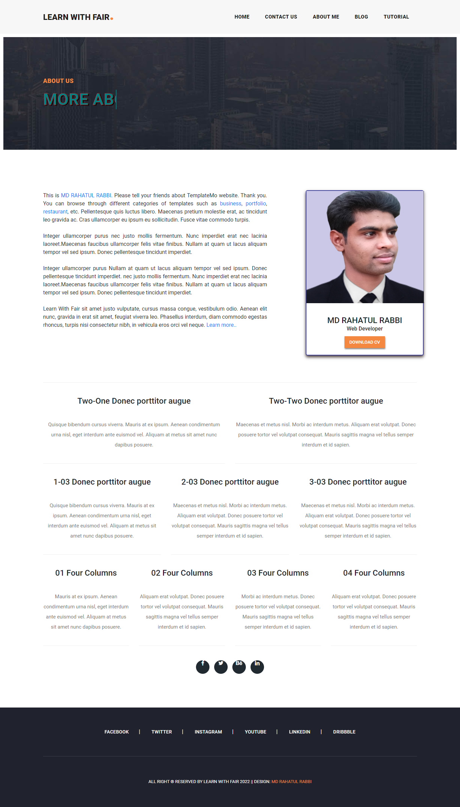
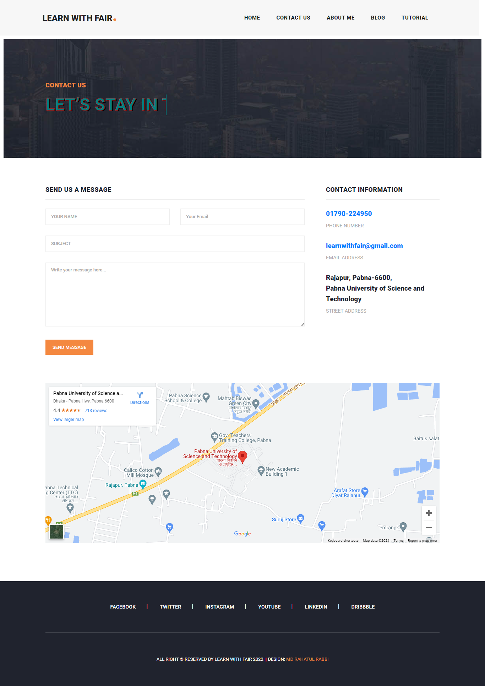
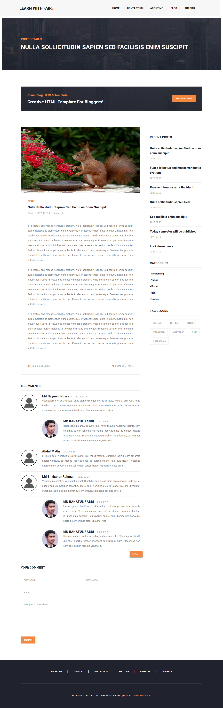
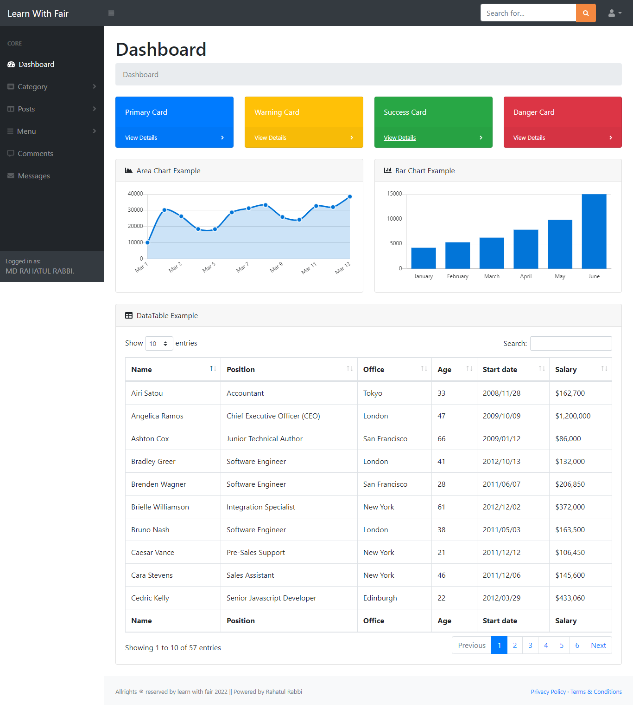

# PHP-BLOG-PROJECT

[![Youtube][youtube-shield]][youtube-url]
[![Facebook][facebook-shield]][facebook-url]
[![Instagram][instagram-shield]][instagram-url]
[![LinkedIn][linkedin-shield]][linkedin-url]

Thanks for visiting my GitHub account!

 **Hypertext Preprocessor (PHP)** is a general-purpose scripting language geared towards web development. It was created by Danish-Canadian programmer Rasmus Lerdorf in 1993 and released in 1995. The PHP reference implementation is now produced by the PHP Group. PHP was originally an abbreviation of Personal Home Page, but it now stands for the recursive initialism PHP: Hypertext Preprocessor.

### See More

- Visit-> https://www.w3schools.com/php/php_intro.asp
- Visit -> https://www.tutorialspoint.com/php/index.htm

### [Code-Example](https://github.com/learnwithfair/PHP-Code)

## Source Code (Download)

[Click Here]()

## Required Software (Download)

- VS Code, Download ->https://code.visualstudio.com/download
- Xampp, Download ->https://www.apachefriends.org/download.html

## Project Features

|                                        |                                       |
| :------------------------------------: | :-----------------------------------: |
|               Home-Page                |               Blog-Page               |
|         |        |
|               About-Page               |             Contact-Page              |
|        |  |
|              Single-Page               |               Dashboard               |
|  |   |

## Template Includes

- HTML
- CSS
- PHP
- MySQL
- Bootstrap
- JQuery

## How to use this Project

- Step-1: Clone this repository in your local machine using `gh repo clone learnwithfair/php-blog-project `
- Step-2: Put the **blog** directory in the C:\xampp\htdocs folder.
- Step-3: Create a database named **blog_project** in the `http://localhost/phpmyadmin/ `
- Step-4: Import the database file in the **blog_project** Database.
- Step-5: Run this project in the browser using `url-> http://localhost/blog `
- Step-6: For login Dashboard using url -> `http://localhost/blog/admin `
- Step-7: Admin Login Info-

```php
Email: learnwithfair@gmail.com
Password: 123456
```

## Follow Me

[](https://github.com/learnwithfair) [](https://www.facebook.com/learnwithfair/) [](https://www.instagram.com/learnwithfair/) [](https://www.twiter.com/learnwithfair/) [](https://www.youtube.com/@learnwithfair)

<!-- MARKDOWN LINKS & IMAGES -->

[youtube-shield]: https://img.shields.io/badge/-Youtube-black.svg?style=flat-square&logo=youtube&color=555&logoColor=white
[youtube-url]: https://youtube.com/@learnwithfair
[facebook-shield]: https://img.shields.io/badge/-Facebook-black.svg?style=flat-square&logo=facebook&color=555&logoColor=white
[facebook-url]: https://facebook.com/learnwithfair
[instagram-shield]: https://img.shields.io/badge/-Instagram-black.svg?style=flat-square&logo=instagram&color=555&logoColor=white
[instagram-url]: https://instagram.com/learnwithfair
[linkedin-shield]: https://img.shields.io/badge/-LinkedIn-black.svg?style=flat-square&logo=linkedin&colorB=555
[linkedin-url]: https://linkedin.com/company/learnwithfair
